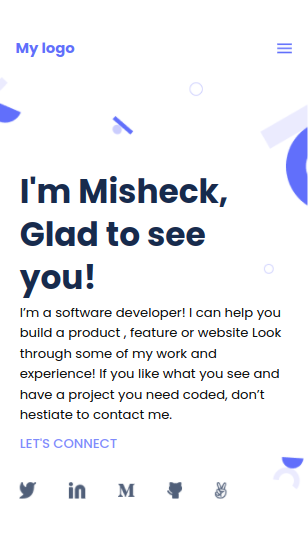

# Project Name

> This is my first project with microverse,in this project i created a portifolio skeleton for mobile view,

#
# Built With

>HTML
>css

## Live Demo (if available)

[Live Demo Link](https://livedemo.com)

## Getting Started
### Prerequisites

### Setup

### Install

### Usage

### Run tests

### Deployment

## Authors

👤 **Author1**

- GitHub: [@githubhandle](https://github.com/misheck12)
- Twitter: [@twitterhandle](https://twitter.com/MisheckLivingi2)
- LinkedIn: [LinkedIn](https://www.linkedin.com/in/misheck-livingi-a0b536142/)

## 🤝 Contributing

Contributions, issues, and feature requests are welcome!

feel free to reach me on any of the above social links.

## Show your support

Give a ⭐️ if you like this project!

## Acknowledgments

## 📝 License

This project is [MIT](./MIT.md) licensed.
